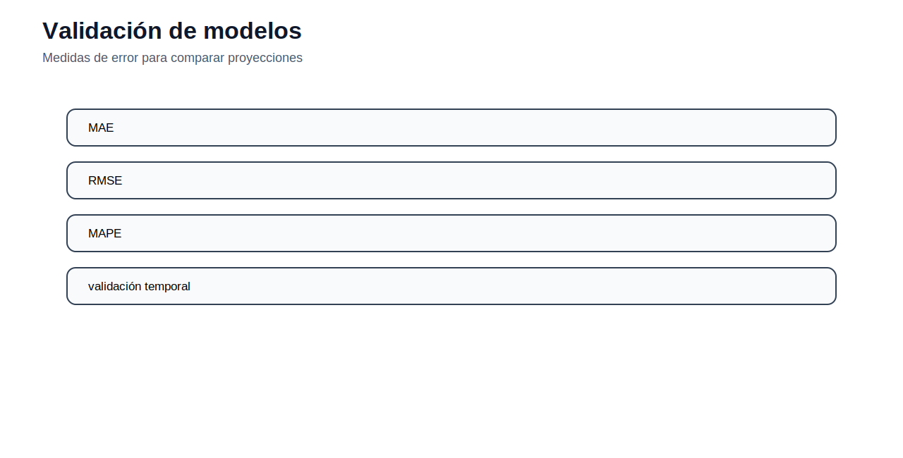
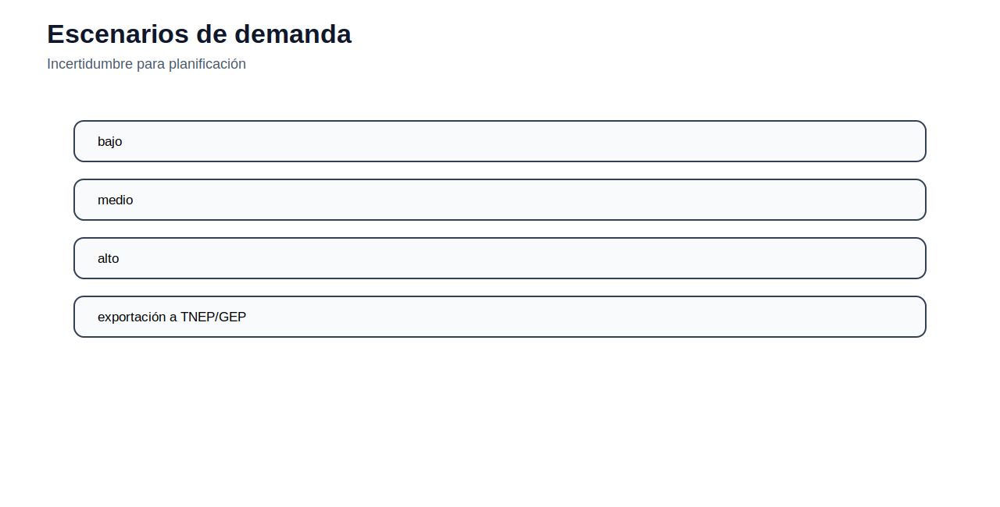

# 04 — Proyección de demanda eléctrica

[Menú principal](../../README.md) · [Actividades](actividades/README.md) · [Datos](datos/)

## Propósito del módulo

En los módulos de operación, la demanda se utiliza como parámetro conocido. En planificación, en cambio, la demanda futura debe estimarse antes de decidir expansión de red o generación. Una mala proyección puede llevar a subinversión, sobreinversión o conclusiones equivocadas sobre confiabilidad.

La demanda eléctrica debe estudiarse separando energía y potencia pico. La energía anual o mensual se relaciona con consumo acumulado, costos variables y generación esperada. La potencia pico condiciona capacidad instalada, reserva y dimensionamiento de red. Por eso los modelos de TNEP y GEP requieren insumos distintos: demanda por barra, demanda máxima, bloques de carga, energía anual y escenarios.

## Datos, tendencia y validación

Una serie de demanda puede contener tendencia, estacionalidad, cambios estructurales y valores atípicos. Antes de ajustar un modelo, se debe revisar la calidad de los datos: unidades, años faltantes, saltos no explicados, coherencia entre energía y pico, y correspondencia con variables explicativas como población, actividad económica o electrificación.

Las métricas de error permiten comparar alternativas de proyección. El error absoluto medio se calcula como:

$$
MAE=\frac{1}{n}\sum_{t=1}^{n}|D_t-\hat{D}_t|.
$$

El RMSE penaliza con más fuerza los errores grandes:

$$
RMSE=\sqrt{\frac{1}{n}\sum_{t=1}^{n}(D_t-\hat{D}_t)^2}.
$$

El MAPE expresa el error relativo en porcentaje:

$$
MAPE=\frac{100}{n}\sum_{t=1}^{n}\left|\frac{D_t-\hat{D}_t}{D_t}\right|.
$$

Una proyección no debe reportarse como una única curva cuando existe incertidumbre relevante. Una forma simple de construir escenarios es aplicar una desviación sobre el caso medio:

$$
D_y^{alto}=D_y^{medio}(1+\Delta_y),\qquad D_y^{bajo}=D_y^{medio}(1-\Delta_y).
$$

## Salidas hacia planificación

La salida del módulo no es solo una figura de demanda. Debe producir tablas utilizables por los modelos posteriores. Para TNEP se requiere demanda por barra o por zona. Para GEP se requieren demanda pico, energía y bloques representativos. La curva de duración de carga permite transformar perfiles horarios en bloques de operación con duración asociada.

## Lectura técnica de las figuras

La energía y el pico responden a preguntas diferentes. Dos sistemas con la misma energía anual pueden tener requerimientos de capacidad distintos si sus picos son diferentes.

La tendencia explica crecimiento de largo plazo; la estacionalidad explica patrones repetitivos. Separarlas ayuda a construir escenarios razonables.

La validación compara proyecciones contra datos observados. Una métrica aislada no basta: conviene revisar error medio, error en pico, sesgo y comportamiento en años recientes.

Los escenarios permiten evaluar robustez. En expansión, una solución que solo funciona para el promedio puede fallar bajo crecimiento alto.

## Modelos del módulo

| Recurso | Concepto principal | Acceso |
|---|---|---|
| Exploración de demanda | limpieza, gráficos y consistencia de datos | [Abrir](modelos/01_exploracion_demanda.md) |
| Regresión de demanda | relación con variables explicativas | [Abrir](modelos/02_regresion_demanda.md) |
| Series temporales | tendencia, estacionalidad y pronóstico | [Abrir](modelos/03_series_tiempo.md) |
| Escenarios y exportación | tablas para TNEP y GEP | [Abrir](modelos/04_escenarios_exportacion.md) |

## Actividad del módulo

La actividad se desarrolla desde [actividades/README.md](actividades/README.md). El estudiante debe construir una proyección base, generar al menos dos escenarios, validar errores con datos históricos y exportar tablas compatibles con los módulos de expansión.

---

[Menú principal](../../README.md) · [Actividades](actividades/README.md) · [Datos](datos/)
