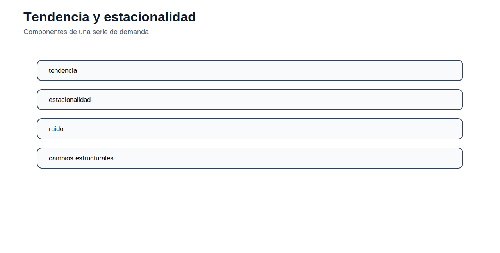

[← Inicio](../../README.md) | [← Módulo anterior](../04_opf/README.md) | [Siguiente módulo →](../06_tnep/README.md)

# Módulo 05 — Proyección de demanda y construcción de escenarios

## Objetivo del módulo

El módulo estudia cómo preparar demanda eléctrica para modelos de operación y planificación. La demanda no es solo un dato escalar: puede representarse como energía anual, demanda máxima, perfil horario, bloques de carga, demanda por barra, escenarios de crecimiento o trayectorias de largo plazo.

## Contenidos

1. [Energía, potencia pico y perfiles](#energía-potencia-pico-y-perfiles)
2. [Tendencia y estacionalidad](#tendencia-y-estacionalidad)
3. [Variables explicativas](#variables-explicativas)
4. [Modelos de proyección](#modelos-de-proyección)
5. [Métricas de validación](#métricas-de-validación)
6. [Escenarios de demanda](#escenarios-de-demanda)
7. [Exportación hacia AMPL](#exportación-hacia-ampl)
8. [Archivos incluidos](#archivos-incluidos)
9. [Actividad propuesta](#actividad-propuesta)

## Energía, potencia pico y perfiles

La energía mide consumo acumulado en un periodo, por ejemplo MWh o GWh. La potencia pico mide la máxima demanda instantánea o promedio en una ventana específica, por ejemplo MW. Ambas magnitudes son necesarias, pero responden a preguntas distintas.

La energía anual afecta costos variables, consumo de combustible y balance energético. La demanda pico condiciona capacidad instalada, reserva, transformación, líneas y confiabilidad.


El factor de carga resume la relación entre demanda media y demanda máxima:

$$
LF = \frac{D_{media}}{D_{max}} = \frac{E/T}{D_{max}}
$$

Un sistema con bajo factor de carga requiere capacidad para atender picos que ocurren durante pocas horas. Esto incrementa la importancia de tecnologías de punta, almacenamiento o gestión de demanda.

## Tendencia y estacionalidad

Una serie de demanda puede contener tendencia de largo plazo, patrones estacionales, variación diaria, efectos climáticos, cambios económicos y eventos atípicos. Antes de proyectar, se debe observar la serie, revisar faltantes, detectar valores extremos y confirmar unidades.



Una proyección sin diagnóstico puede reproducir errores históricos o producir curvas incompatibles con el sistema. Por ejemplo, proyectar solo energía anual no garantiza una demanda pico coherente; proyectar solo pico no garantiza balance energético.

## Variables explicativas

Los modelos de demanda pueden usar variables como población, producto interno bruto, temperatura, electrificación, urbanización, número de clientes, eficiencia energética o penetración de nuevas cargas. La selección de variables debe responder a causalidad plausible, disponibilidad de datos y estabilidad temporal.

Una regresión múltiple puede escribirse como:

$$
D_t = \beta_0 + \beta_1 X_{1,t}+\beta_2 X_{2,t}+\cdots+\varepsilon_t
$$

El coeficiente $\beta_i$ representa el cambio esperado en demanda ante cambios en la variable explicativa $X_i$, manteniendo las demás constantes. La interpretación debe ser técnica; no basta obtener un ajuste estadístico alto.

## Modelos de proyección

Los métodos usuales incluyen:

| Método | Uso principal |
|---|---|
| Crecimiento compuesto | Escenarios simples de largo plazo. |
| Regresión | Relación demanda–variables explicativas. |
| Series de tiempo | Tendencia, autocorrelación y estacionalidad. |
| Modelos híbridos | Combinación de señales históricas y restricciones técnicas. |

Un crecimiento compuesto se calcula como:

$$
D_y = D_0(1+g)^y
$$

Este método es transparente y fácil de auditar, pero puede ser insuficiente cuando existen cambios estructurales en consumo, clima o electrificación.

## Métricas de validación

Las métricas permiten comparar modelos:

$$
MAE=\frac{1}{n}\sum_{t=1}^{n}|D_t-\hat{D}_t|
$$

$$
RMSE=\sqrt{\frac{1}{n}\sum_{t=1}^{n}(D_t-\hat{D}_t)^2}
$$

$$
MAPE=\frac{100}{n}\sum_{t=1}^{n}\left|\frac{D_t-\hat{D}_t}{D_t}\right|
$$


El RMSE penaliza errores grandes, el MAE es más estable ante valores extremos y el MAPE permite una lectura porcentual, aunque puede ser problemático cuando los valores reales son cercanos a cero.

## Escenarios de demanda

La planificación no debe depender de una sola trayectoria. Se recomienda construir escenarios bajo, medio y alto, asociados a distintos supuestos de crecimiento económico, electrificación, eficiencia o penetración tecnológica.


Los escenarios no son simples líneas dibujadas. Deben mantener coherencia entre energía, pico, distribución temporal y demanda por barra. En modelos de expansión, una demanda mal construida puede sobredimensionar o subdimensionar inversiones.

## Exportación hacia AMPL

Para usar demanda en AMPL, los datos deben llegar en una forma indexada consistente. Por ejemplo:

```ampl
set B;
set Y;
param demand {B,Y};
```

En Python, una tabla con columnas `bloque`, `anio` y `demanda` puede convertirse a formato `.dat`. El módulo incluye scripts para proyectar demanda básica y exportarla a modelos posteriores.

## Archivos incluidos

| Archivo | Uso |
|---|---|
| [datos/demanda_historica.csv](datos/demanda_historica.csv) | Serie histórica base. |
| [datos/demanda_proyectada_escenarios.csv](datos/demanda_proyectada_escenarios.csv) | Escenarios de demanda. |
| [python/demand_projection_basic.py](python/demand_projection_basic.py) | Proyección básica con Python. |
| [python/export_demand_to_ampl_dat.py](python/export_demand_to_ampl_dat.py) | Exportación a formato AMPL. |
| [figuras/](figuras/) | Figuras del módulo. |

## Cómo ejecutar

Desde `modulos/05_demanda/`:

```bash
python python/demand_projection_basic.py
python python/export_demand_to_ampl_dat.py
```

## Actividad propuesta

Construya tres escenarios de demanda a partir de una demanda base: crecimiento bajo, medio y alto. Para cada escenario, calcule energía anual, demanda pico y factor de carga. Luego exporte la demanda a un archivo compatible con AMPL para usarlo en un modelo de expansión.
