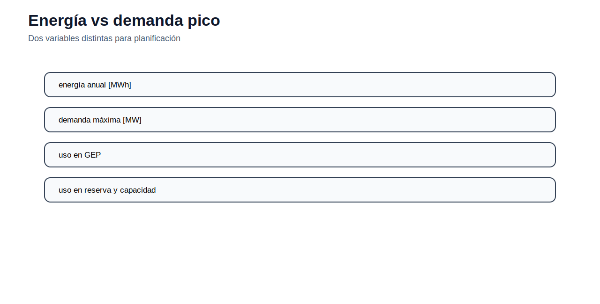

[← Inicio](../../README.md) | [← Módulo anterior](../04_opf/README.md) | [Siguiente módulo →](../06_tnep/README.md)

# Módulo 05 — Proyección de demanda

## Propósito

La demanda es el principal dato de enlace entre operación y planificación. En este módulo se construyen series de energía y potencia pico, se calculan indicadores básicos y se preparan escenarios para modelos de expansión.

## Competencia

Procesar información histórica de demanda, construir escenarios y entregar tablas consistentes para modelos de TNEP y GEP.

## Caso 1. Base histórica

### Enunciado

A partir de una serie anual de energía y demanda pico, calcule demanda media, factor de carga y tasas de crecimiento. La interpretación debe distinguir energía [GWh] y potencia [MW].

### Datos del caso

|   anio |   energia_gwh |   pico_mw |   poblacion_millones |   pib_indice |
|-------:|--------------:|----------:|---------------------:|-------------:|
|   2018 |         25000 |      4200 |                 16.9 |          100 |
|   2019 |         25800 |      4350 |                 17.1 |          101 |
|   2020 |         25200 |      4280 |                 17.3 |           96 |
|   2021 |         26800 |      4480 |                 17.5 |          100 |
|   2022 |         27900 |      4650 |                 17.7 |          104 |
|   2023 |         29100 |      4820 |                 17.9 |          107 |
|   2024 |         30300 |      4990 |                 18.1 |          110 |

### Cálculos requeridos

Demanda media anual:

$$
\bar D_y=\frac{E_y\cdot 1000}{8760}
$$

Factor de carga:

$$
LF_y=\frac{\bar D_y}{D_y^{peak}}
$$

Crecimiento anual:

$$
g_y=\frac{X_y-X_{y-1}}{X_{y-1}}
$$

### Actividad

Construya una tabla con energía, pico, demanda media, factor de carga y crecimiento anual. Explique el comportamiento del año 2020 y decida si debe usarse directamente para proyectar.

## Caso 2. Regresión con variables explicativas

### Enunciado

Se desea aproximar la evolución de energía o potencia pico mediante variables explicativas. Use población e índice de PIB para comparar una regresión simple contra una proyección por CAGR.

### Formulación de trabajo

Para energía o potencia pico:

$$
Y_t=\beta_0+\beta_1\,Pop_t+\beta_2\,PIB_t+\varepsilon_t
$$

### Actividad

Ajuste la regresión para energía y para potencia pico. Compare la tendencia resultante con el CAGR histórico. Reporte parámetros, error de ajuste y decisión sobre qué método usaría para preparar datos de expansión.

## Caso 3. Escenarios de demanda

### Enunciado

Prepare tres trayectorias de demanda: baja, media y alta. Estas trayectorias deben quedar listas para alimentar modelos de transmisión y generación.

### Datos del caso

|   anio | escenario   |   energia_gwh |   pico_mw |
|-------:|:------------|--------------:|----------:|
|   2025 | bajo        |         30900 |      5070 |
|   2025 | medio       |         31200 |      5120 |
|   2025 | alto        |         31600 |      5200 |
|   2030 | bajo        |         34000 |      5600 |
|   2030 | medio       |         35600 |      5850 |
|   2030 | alto        |         37400 |      6150 |
|   2035 | bajo        |         37200 |      6100 |
|   2035 | medio       |         40500 |      6650 |
|   2035 | alto        |         43800 |      7200 |

### Parámetros para modelos

Para TNEP se requiere principalmente potencia pico por barra o por sistema:

|   anio | escenario   |   pico_mw |
|-------:|:------------|----------:|
|   2025 | bajo        |      5070 |
|   2025 | medio       |      5120 |
|   2025 | alto        |      5200 |
|   2030 | bajo        |      5600 |
|   2030 | medio       |      5850 |
|   2030 | alto        |      6150 |
|   2035 | bajo        |      6100 |
|   2035 | medio       |      6650 |
|   2035 | alto        |      7200 |

Para GEP se requiere energía y pico, porque los bloques de carga aproximan la duración anual de la demanda:

|   anio | escenario   |   energia_gwh |   pico_mw |
|-------:|:------------|--------------:|----------:|
|   2025 | bajo        |         30900 |      5070 |
|   2025 | medio       |         31200 |      5120 |
|   2025 | alto        |         31600 |      5200 |
|   2030 | bajo        |         34000 |      5600 |
|   2030 | medio       |         35600 |      5850 |
|   2030 | alto        |         37400 |      6150 |
|   2035 | bajo        |         37200 |      6100 |
|   2035 | medio       |         40500 |      6650 |
|   2035 | alto        |         43800 |      7200 |

### Actividad

Construya dos archivos `.dat`: uno para TNEP con años, escenarios y potencia pico; otro para GEP con energía, potencia pico y bloques de carga. Verifique unidades y explique qué escenario utilizaría para un análisis conservador de inversión.

## Entregables

- Tabla histórica procesada.
- Gráfico de energía y pico.
- Tabla de escenarios para TNEP.
- Tabla de escenarios para GEP.
- Justificación del escenario usado en planificación.

## Evaluación

| Criterio | Ponderación |
|---|---:|
| Cálculo de demanda media, factor de carga y crecimiento | 25 % |
| Comparación de métodos de proyección | 25 % |
| Construcción de escenarios | 25 % |
| Consistencia de unidades | 15 % |
| Justificación técnica | 10 % |

## Archivos de datos

| Archivo | Uso |
|---|---|
| `demanda_gep.csv` | Tabla editable del caso |
| `demanda_historica.csv` | Tabla editable del caso |
| `demanda_proyectada_escenarios.csv` | Tabla editable del caso |
| `demanda_tnep.csv` | Tabla editable del caso |
