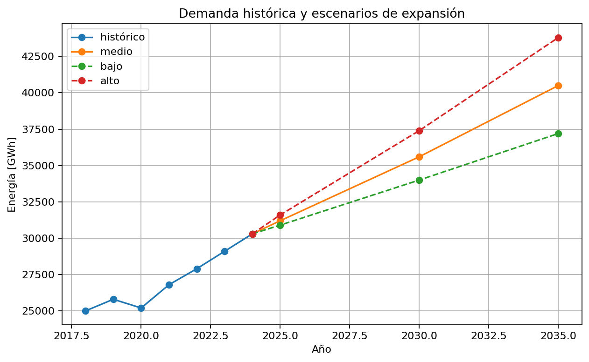

# 05 — Proyección de demanda eléctrica

[Menú principal](../../README.md) · [Actividades](actividades/README.md) · [Datos](datos/)

## Pregunta guía

¿Cómo deja de ser la demanda un parámetro fijo y se convierte en un insumo estratégico para la expansión del sistema eléctrico?

## Contexto técnico

En operación y OPF, la demanda se usa como dato. En expansión, la demanda futura es incierta y debe proyectarse. Por eso este módulo se ubica después de OPF y antes de TNEP/GEP.

## Desarrollo conceptual

```text
demanda como parámetro operativo → demanda como trayectoria futura → energía anual vs demanda pico → datos históricos → modelos de proyección → validación → escenarios → exportación a expansión
```

## Figura central



## Flujos incluidos

| Modelo | Enlace |
| --- | --- |
| Flujo 01 — Exploración de demanda | [Abrir](modelos/01_exploracion_demanda.md) |
| Flujo 02 — Regresión de demanda | [Abrir](modelos/02_regresion_demanda.md) |
| Flujo 03 — Series temporales | [Abrir](modelos/03_series_tiempo.md) |
| Flujo 04 — Escenarios y exportación | [Abrir](modelos/04_escenarios_exportacion.md) |

## Validación de resultados

La proyección debe tener unidades claras; la trayectoria media debe ser coherente con la historia; los escenarios deben estar ordenados; TNEP debe usar pico; GEP debe usar energía, pico y bloques.
