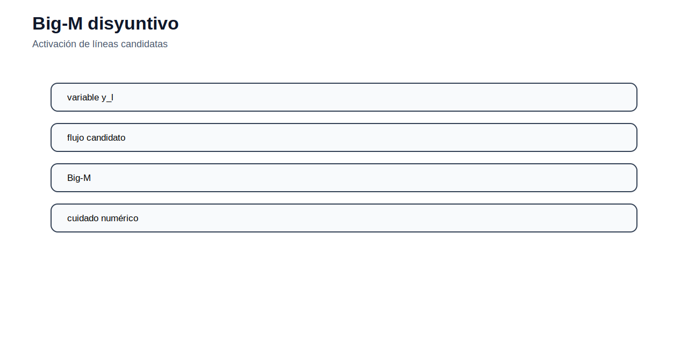

# 05 — Expansión de transmisión

[Menú principal](../../README.md) · [Actividades](actividades/README.md) · [Datos](datos/) · [Guía AMPL](../../docs/guia_ampl.md)

## Propósito del módulo

La expansión de transmisión decide qué líneas, circuitos o refuerzos construir para transportar energía desde los puntos de generación hacia los centros de demanda. La decisión debe equilibrar inversión, congestión, energía no servida y seguridad operativa. En planificación, la red futura debe ser capaz de atender escenarios de demanda y generación que aún no se han materializado.

El TNEP puede formularse con distinto nivel de detalle. El modelo de transporte representa capacidad de transferencia sin ángulos. El modelo DC incorpora leyes aproximadas de flujo activo. Las formulaciones disyuntivas permiten activar líneas candidatas mediante variables binarias. La versión multietapa decide no solo qué construir, sino cuándo hacerlo.

## Modelos de red para expansión

En un modelo de transporte, el flujo por un corredor se limita por la capacidad total existente y nueva:

$$
-\overline{F}_\ell(n_\ell^0+n_\ell)\leq F_\ell\leq \overline{F}_\ell(n_\ell^0+n_\ell).
$$

El costo de inversión se calcula como:

$$
C^{inv}=\sum_{\ell}c_\ell n_\ell,
$$

donde $n_\ell$ representa el número de circuitos nuevos en el corredor $\ell$.

En el modelo DC, los flujos se vinculan con ángulos:

$$
F_\ell = B_\ell(n_\ell^0+n_\ell)(\theta_i-\theta_j).
$$

Cuando una línea candidata puede existir o no existir, se usa una variable binaria $y_\ell$ y una constante de activación:

$$
-My_\ell\leq F_\ell\leq My_\ell.
$$

En expansión multietapa, la capacidad instalada se acumula:

$$
N_{\ell,t}=N_{\ell,t-1}+n_{\ell,t}.
$$

Esta ecuación evita reconstruir el mismo proyecto varias veces y permite diferir inversiones si no son necesarias en los primeros años.

## Demanda, ENS y confiabilidad

El balance nodal o zonal debe atender la demanda proyectada. La energía no servida puede incluirse como variable de penalización para evitar infactibilidad y medir la severidad de restricciones de red. Si el costo de ENS es demasiado bajo, el modelo puede preferir racionar demanda en lugar de construir; si es demasiado alto, forzará inversión para evitar déficit. Por eso la selección de VOLL debe discutirse técnicamente.

## Lectura técnica de las figuras

La figura separa infraestructura existente y alternativas candidatas. Esta distinción define qué flujos son obligatorios, qué capacidades ya están disponibles y qué decisiones son de inversión.

El modelo de transporte es útil para una primera aproximación, pero no captura el reparto físico del flujo. El modelo DC introduce ángulos y permite estudiar congestión de forma más realista.

La constante $M$ activa o desactiva restricciones asociadas a candidatos. Su valor debe ser suficientemente grande para no cortar soluciones factibles y suficientemente moderado para evitar problemas numéricos.

En planificación temporal, construir antes puede reducir congestión, pero aumenta costo presente. Construir después puede ahorrar inversión, pero puede aumentar ENS o congestión en años intermedios.

## Modelos del módulo

| Recurso | Concepto principal | Acceso |
|---|---|---|
| Modelo de transporte | capacidad de corredores sin ángulos | [Abrir](modelos/01_modelo_transporte_expansion_transmision.md) |
| Modelo constructivo | refuerzo progresivo de red | [Abrir](modelos/02_modelo_constructivo_refuerzo_red.md) |
| Modelo DC | expansión con ángulos y flujos físicos | [Abrir](modelos/03_modelo_dc_expansion_transmision.md) |
| Modelo híbrido | aproximación intermedia para red | [Abrir](modelos/04_modelo_hibrido_expansion_transmision.md) |
| Modelo lineal disyuntivo | activación binaria de candidatos | [Abrir](modelos/05_modelo_lineal_disyuntivo_expansion_transmision.md) |
| Modelo multietapa | momento de construcción | [Abrir](modelos/06_modelo_multietapa_expansion_transmision.md) |

## Actividad del módulo

La actividad se desarrolla desde [actividades/README.md](actividades/README.md). El estudiante debe formular un problema TNEP, preparar datos de barras y corredores, resolver el caso base, identificar refuerzos seleccionados y comparar el resultado con un escenario de demanda mayor.

---

[Menú principal](../../README.md) · [Actividades](actividades/README.md) · [Datos](datos/)
