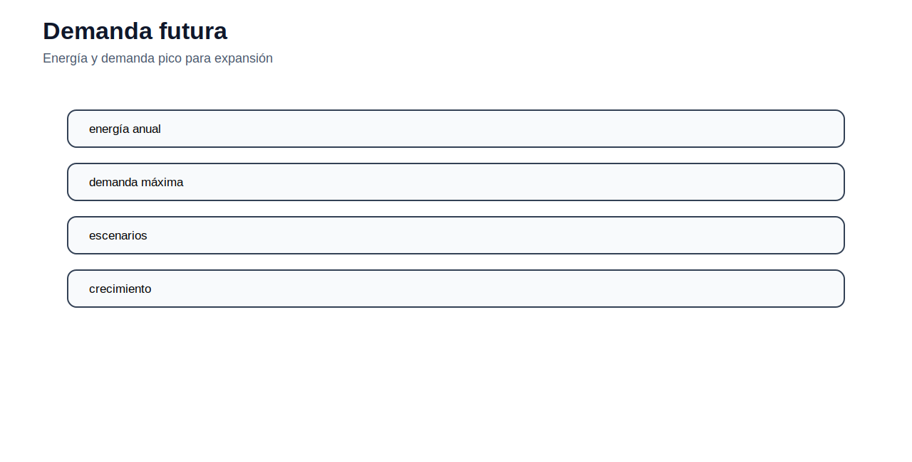
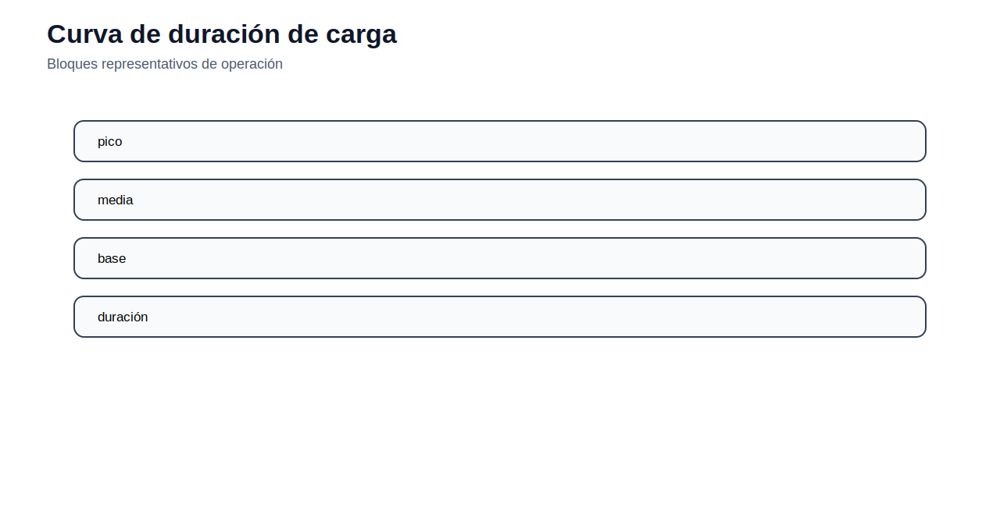
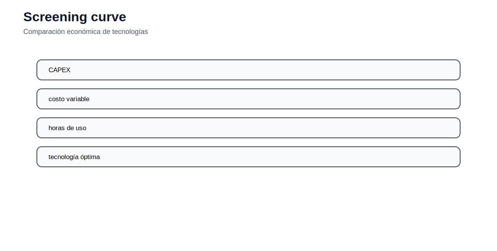

# 06 — Expansión de generación

[Menú principal](../../README.md) · [Actividades](actividades/README.md) · [Datos](datos/)

## Introducción conceptual

La expansión de generación decide qué tecnologías construir, cuánta capacidad instalar y cuándo hacerlo para atender demanda futura con criterios de costo, suficiencia y confiabilidad.

## Fundamentos del tema

El módulo utiliza demanda proyectada, tecnologías candidatas, costos de inversión, costos variables, disponibilidad, crédito firme, bloques de carga, reserva y energía no servida.

## Figuras técnicas principales

Energía y demanda pico para expansión

Bloques representativos de operación

Comparación económica de tecnologías

Capacidad instalada no equivale siempre a capacidad firme

## Ecuaciones base

### Capacidad acumulada

$$
Cap_{k,y}=Cap_{k,y-1}+Build_{k,y}
$$

La inversión se acumula.

### Balance por bloque

$$
\sum_kGen_{k,y,b}+ENS_{y,b}=D_{y,b}
$$

Demanda por bloque.

### Disponibilidad

$$
Gen_{k,y,b}\leq AF_kCap_{k,y}h_b
$$

Generación limitada por capacidad y disponibilidad.

### Reserva

$$
\sum_kFC_kCap_{k,y}\geq(1+RM)D_y^{peak}
$$

Suficiencia de capacidad.

## Ejemplos o modelos del módulo

| Recurso | Qué aporta | Acceso |
|---|---|---|
| GEP estático | capacidad en un periodo | [Abrir](modelos/01_modelo_gep_estatico_capacidad.md) |
| GEP con bloques | operación representativa | [Abrir](modelos/02_modelo_gep_bloques_carga.md) |
| GEP multianual | horizonte temporal | [Abrir](modelos/03_modelo_gep_multianual.md) |

## Capa de datos de la v14

Las páginas de ejemplos/modelos del módulo incluyen datos suficientes para construir archivos de datos de trabajo. En los modelos AMPL se incluye una plantilla `.dat` sugerida en el propio README del modelo; en el módulo de demanda se especifican plantillas CSV para Python y archivos de salida hacia TNEP/GEP.

## Actividad del módulo

Revise [actividades/README.md](actividades/README.md) y desarrolle la actividad principal: **Actividad 06 — Expansión de generación**.

---

[Menú principal](../../README.md) · [Actividades](actividades/README.md) · [Datos](datos/)
