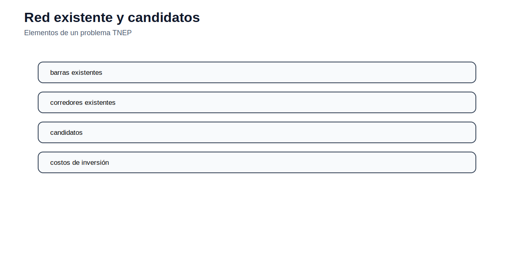
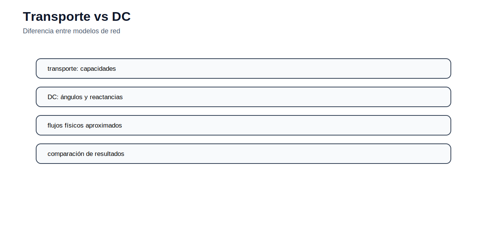
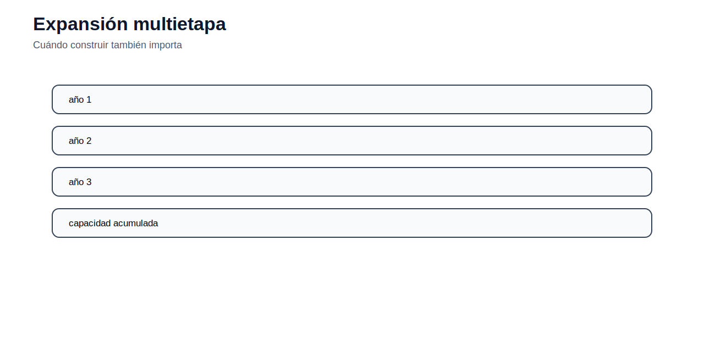

[← Inicio](../../README.md) | [← Módulo anterior](../05_demanda/README.md) | [Siguiente módulo →](../07_gep/README.md)

# Módulo 06 — Expansión de transmisión

## Objetivo del módulo

El módulo estudia la planificación de expansión de transmisión. La decisión no es solo operar la red existente, sino seleccionar refuerzos o nuevas líneas para atender demanda futura, reducir congestión, evitar energía no servida y mejorar la capacidad de transporte del sistema.

## Contenidos

1. [Problema de expansión de transmisión](#problema-de-expansión-de-transmisión)
2. [Modelo de transporte](#modelo-de-transporte)
3. [Modelo DC de expansión](#modelo-dc-de-expansión)
4. [Variables binarias de inversión](#variables-binarias-de-inversión)
5. [Formulación Big-M](#formulación-big-m)
6. [Expansión multietapa](#expansión-multietapa)
7. [Archivos incluidos](#archivos-incluidos)
8. [Actividad propuesta](#actividad-propuesta)

## Problema de expansión de transmisión

La expansión de transmisión decide qué corredores construir o reforzar para que la red pueda transportar energía desde zonas de generación hacia zonas de demanda. En términos de planificación, se comparan costos de inversión con beneficios operativos: menor congestión, menor generación costosa, reducción de energía no servida y mayor seguridad del suministro.



El problema se vuelve combinatorio porque cada línea candidata puede construirse o no construirse. Además, las decisiones de red modifican los flujos eléctricos y por tanto la operación económica del sistema.

## Modelo de transporte

Una primera aproximación ignora ángulos eléctricos y representa la red como capacidad de transporte. La formulación típica es:

$$
\min \sum_{(i,j)\in L} C_{i,j}^{inv}y_{i,j}+\sum_n VOLL\cdot LS_n
$$

sujeto a balance nodal:

$$
G_n + LS_n - D_n = \sum_{(n,j)} f_{n,j}-\sum_{(i,n)} f_{i,n}
$$

Y límites de flujo:

$$
-F_{i,j}^{max}(e_{i,j}+y_{i,j}) \leq f_{i,j} \leq F_{i,j}^{max}(e_{i,j}+y_{i,j})
$$

Este modelo es útil para introducir la lógica de expansión, aunque no representa la física DC de los flujos.



## Modelo DC de expansión

El modelo DC agrega la relación entre flujo y ángulos:

$$
f_{i,j}=B_{i,j}(\theta_i-\theta_j)
$$

Para líneas existentes, esta relación siempre se cumple. Para líneas candidatas, solo debe cumplirse si la línea se construye. Esta condición lógica requiere variables binarias o formulaciones disyuntivas.

## Variables binarias de inversión

La decisión de construir una línea candidata se representa como:

$$
y_{i,j}\in\{0,1\}
$$

Si $y_{i,j}=1$, la línea se construye y puede transportar flujo. Si $y_{i,j}=0$, el flujo debe ser cero y la ecuación DC no debe forzar relación entre ángulos de barras no conectadas.

La función objetivo combina inversión y operación:

$$
\min \sum_{(i,j)} C_{i,j}^{inv}y_{i,j}+\sum_g c_gP_g+\sum_n VOLL\cdot LS_n
$$

## Formulación Big-M

Para líneas candidatas, una forma lineal de activar la ecuación DC es:

$$
f_{i,j}-B_{i,j}(\theta_i-\theta_j) \leq M(1-y_{i,j})
$$

$$
f_{i,j}-B_{i,j}(\theta_i-\theta_j) \geq -M(1-y_{i,j})
$$

Si $y_{i,j}=1$, ambas restricciones obligan a cumplir la ecuación DC. Si $y_{i,j}=0$, el término Big-M relaja la ecuación. El valor de $M$ debe elegirse con cuidado para no deteriorar la calidad numérica del MILP.


## Expansión multietapa

En expansión multietapa, las decisiones se distribuyen en años:

$$
y_{i,j,y}\in\{0,1\}
$$

La disponibilidad acumulada de una línea puede representarse como:

$$
z_{i,j,y}=z_{i,j,y-1}+y_{i,j,y}
$$

Esto permite decidir no solo qué construir, sino cuándo construirlo. El tiempo importa porque adelantar una inversión puede reducir costos operativos, pero incrementa el valor presente de la inversión.



## Archivos incluidos

| Archivo | Uso |
|---|---|
| [ampl/tnep_transport.mod](ampl/tnep_transport.mod) | Modelo de expansión tipo transporte. |
| [ampl/tnep_dc.mod](ampl/tnep_dc.mod) | Modelo DC de expansión con candidatos. |
| [datos/tnep_barras.csv](datos/tnep_barras.csv) | Barras del caso. |
| [datos/tnep_corredores.csv](datos/tnep_corredores.csv) | Corredores existentes y candidatos. |
| [python/resumen_candidatos_tnep.py](python/resumen_candidatos_tnep.py) | Revisión de candidatos. |

## Cómo ejecutar

Desde `modulos/06_tnep/ampl/`:

```bash
ampl tnep_transport.run
ampl tnep_dc.run
```

## Actividad propuesta

Resuelva el modelo de transporte y el modelo DC con el mismo conjunto de candidatos. Compare las líneas seleccionadas, el costo total y la energía no servida. Explique por qué el modelo de transporte puede sugerir refuerzos distintos al modelo DC.
