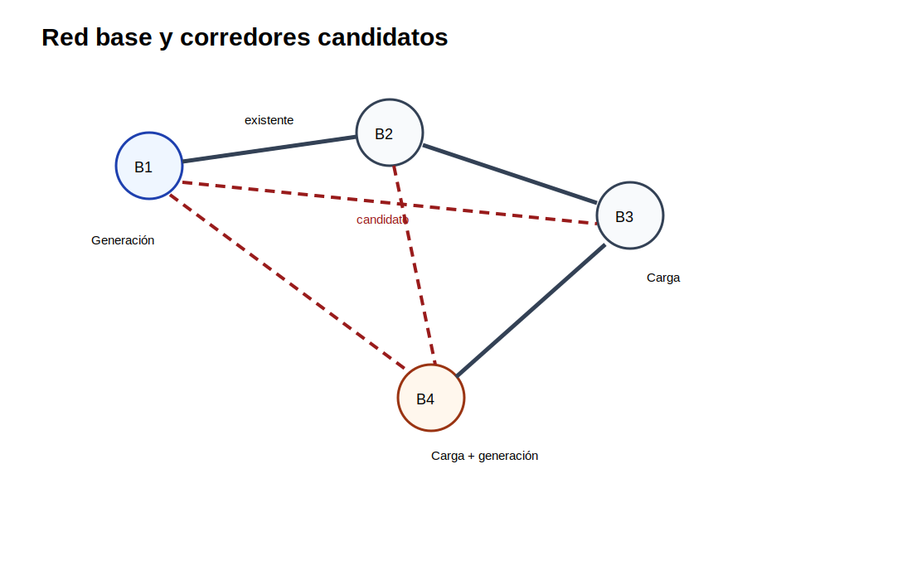

[← Inicio](../../README.md) | [← Módulo anterior](../05_demanda/README.md) | [Siguiente módulo →](../07_gep/README.md)

# Módulo 06 — Expansión de transmisión

## Propósito

El módulo estudia decisiones de inversión en red. La diferencia central frente al OPF es que algunas líneas no existen todavía y deben seleccionarse si reducen costo operativo, energía no servida o congestión.

## Competencia

Formular problemas de expansión de transmisión mediante modelos de transporte, DC-TNEP y expansión multietapa.

## Caso 1. Modelo de transporte para expansión

### Enunciado

Una red de cuatro barras tiene líneas existentes y corredores candidatos. Se debe decidir qué corredores construir para atender la demanda con el menor costo total, considerando inversión y penalización por energía no servida.

### Datos del caso

**Barras**

| bus   |   demanda [MW] |   gen. máxima [MW] |
|:------|---------------:|-------------------:|
| B1    |              0 |                150 |
| B2    |             80 |                  0 |
| B3    |            120 |                  0 |
| B4    |             50 |                100 |

**Corredores existentes y candidatos**

| linea   | desde   | hasta   | tipo      |   x [p.u.] |   Fmax [MW] |   costo inversión [MUSD] |   max_nuevas |
|:--------|:--------|:--------|:----------|-----------:|------------:|-------------------------:|-------------:|
| L12     | B1      | B2      | existente |       0.1  |         100 |                        0 |            0 |
| L23     | B2      | B3      | existente |       0.08 |          80 |                        0 |            0 |
| L34     | B3      | B4      | existente |       0.11 |          70 |                        0 |            0 |
| C13     | B1      | B3      | candidato |       0.12 |          90 |                       40 |            1 |
| C24     | B2      | B4      | candidato |       0.1  |          80 |                       35 |            1 |
| C14     | B1      | B4      | candidato |       0.15 |         100 |                       55 |            1 |

**Parámetros generales**

| parametro   | valor   | unidad   |
|:------------|:--------|:---------|
| slack       | B1      | -        |
| VOLL        | 1000    | USD/MWh  |

### Formulación matemática

**Conjuntos e índices:** $n\in N$, $l\in L^E\cup L^C$.

**Parámetros:** $D_n$, $G_n^{max}$, $F_l^{max}$, $C_l^{inv}$, $VOLL$, origen $o(l)$ y destino $d(l)$.

**Variables:** generación $P_n\geq0$, flujo $f_l$, energía no servida $ENS_n\geq0$, construcción $y_l\in\{0,1\}$ para líneas candidatas.

**Función objetivo**

$$
\min Z=\sum_{l\in L^C}C_l^{inv}y_l+\sum_{n\in N}VOLL\cdot ENS_n
$$

**Restricciones**

Balance nodal:

$$
P_n+ENS_n-D_n=\sum_{l:o(l)=n}f_l-\sum_{l:d(l)=n}f_l\qquad \forall n\in N
$$

Generación máxima:

$$
0\leq P_n\leq G_n^{max}\qquad \forall n\in N
$$

Límites de líneas existentes:

$$
-F_l^{max}\leq f_l\leq F_l^{max}\qquad \forall l\in L^E
$$

Límites de líneas candidatas:

$$
-F_l^{max}y_l\leq f_l\leq F_l^{max}y_l\qquad \forall l\in L^C
$$

### Actividad

Construya el modelo de transporte. Reporte corredores construidos, flujos, energía no servida, costo de inversión y costo de déficit. Explique si la inversión se justifica por capacidad de transferencia o por reducción de energía no servida.

## Caso 2. Modelo DC-TNEP

### Enunciado

El modelo de transporte no impone las leyes de flujo DC. En este caso se agregan ángulos nodales y restricciones de flujo asociadas a la reactancia de cada corredor.

### Formulación matemática

**Variables adicionales:** $\theta_n$.

Para líneas existentes:

$$
f_l=\frac{\theta_{o(l)}-\theta_{d(l)}}{x_l}\qquad \forall l\in L^E
$$

Para líneas candidatas se usa una relajación disyuntiva con $M$ grande:

$$
-M(1-y_l)\leq f_l-\frac{\theta_{o(l)}-\theta_{d(l)}}{x_l}\leq M(1-y_l)\qquad \forall l\in L^C
$$

Referencia angular:

$$
\theta_{slack}=0
$$

### Actividad

Resuelva el caso como DC-TNEP y compare contra el modelo de transporte. Identifique si cambia la línea construida o el costo total. Justifique el resultado a partir de los flujos físicos de la red.

## Caso 3. Expansión multietapa

### Enunciado

La demanda crece en el tiempo. Las líneas construidas en un año permanecen disponibles en los años siguientes. Se debe decidir el momento de construcción.

### Datos del caso

**Años y factores de demanda**

|   anio |   factor_demanda |
|-------:|-----------------:|
|   2025 |             1    |
|   2030 |             1.15 |
|   2035 |             1.35 |

### Formulación matemática

**Conjuntos e índices:** $y\in Y$, $l\in L^C$.

**Variable de construcción anual:** $build_{ly}\in\{0,1\}$.

**Capacidad acumulada:**

$$
y_l^{acc}(y)=\sum_{\tau\in Y:\tau\leq y}build_{l\tau}
$$

**No repetir construcción:**

$$
\sum_{y\in Y}build_{ly}\leq 1\qquad \forall l\in L^C
$$

La demanda anual se calcula como:

$$
D_{ny}=D_n^0\cdot factor_y
$$

### Actividad

Formule el modelo multietapa. Entregue un cronograma de construcción, costo acumulado y energía no servida por año. Discuta si conviene anticipar o postergar inversiones.

## Evaluación

| Criterio | Ponderación |
|---|---:|
| Balance nodal e inversión binaria | 25 % |
| Comparación transporte vs DC-TNEP | 25 % |
| Tratamiento de líneas candidatas | 20 % |
| Formulación multietapa | 20 % |
| Interpretación del plan | 10 % |

## Archivos de datos

| Archivo | Uso |
|---|---|
| `tnep_anios.csv` | Tabla editable del caso |
| `tnep_barras.csv` | Tabla editable del caso |
| `tnep_corredores.csv` | Tabla editable del caso |
| `tnep_parametros.csv` | Tabla editable del caso |
