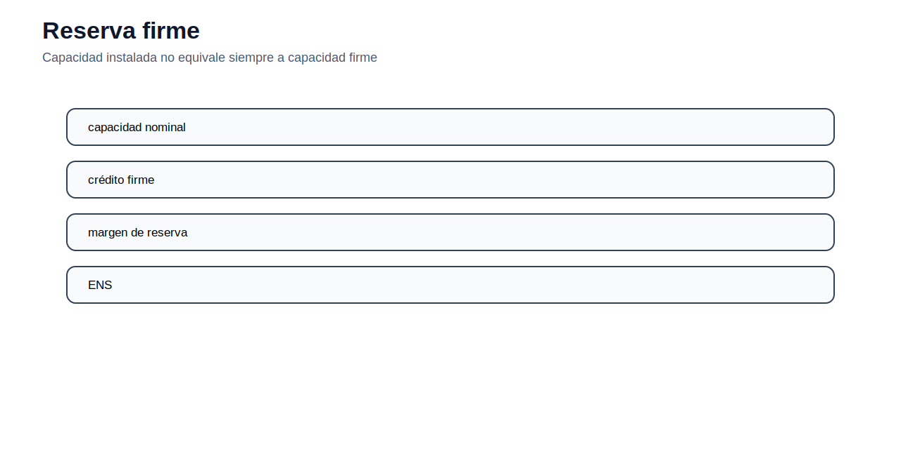

[← Inicio](../../README.md) | [← Módulo anterior](../06_tnep/README.md)

# Módulo 07 — Expansión de generación

## Objetivo del módulo

El módulo estudia la planificación de expansión de generación. La decisión es cuánta capacidad instalar, de qué tecnología y en qué momento, para atender demanda futura con criterios de costo, reserva, disponibilidad y confiabilidad. Aquí se incorporan conceptos económicos de inversión como CAPEX, OPEX fijo, CRF y costos anualizados.

## Contenidos

1. [Problema de expansión de generación](#problema-de-expansión-de-generación)
2. [Costos de inversión y anualización](#costos-de-inversión-y-anualización)
3. [Bloques de carga](#bloques-de-carga)
4. [Restricción de balance](#restricción-de-balance)
5. [Disponibilidad y generación máxima](#disponibilidad-y-generación-máxima)
6. [Reserva firme](#reserva-firme)
7. [Modelo multianual](#modelo-multianual)
8. [Archivos incluidos](#archivos-incluidos)
9. [Actividad propuesta](#actividad-propuesta)

## Problema de expansión de generación

La expansión de generación responde a una pregunta de largo plazo: qué tecnologías deben instalarse para atender una demanda futura con suficiente capacidad y costo razonable. A diferencia del despacho, aquí la capacidad no está completamente dada; parte de ella se decide en el modelo.


Las tecnologías candidatas pueden tener estructuras de costo muy distintas. Una central solar tiene bajo costo variable y generación dependiente del recurso. Una térmica puede tener mayor costo variable pero aportar capacidad firme. Una hidroeléctrica depende de disponibilidad hídrica y restricciones de agua. Por eso no basta comparar capacidad instalada; se debe representar energía, potencia, disponibilidad y reserva.

## Costos de inversión y anualización

El CAPEX se expresa normalmente en USD/kW o USD/MW. Para compararlo con costos anuales de operación, se anualiza mediante el factor de recuperación de capital:

$$
CRF=\frac{r(1+r)^T}{(1+r)^T-1}
$$

El costo anualizado de inversión es:

$$
C^{ann}_{k}=CRF_k \cdot CAPEX_k
$$

La función objetivo puede combinar inversión anualizada, O&M fijo, costos variables y penalización por energía no servida:

$$
\min \sum_k (C_k^{ann}+FOM_k)Build_k + \sum_{k,b} VOM_k Gen_{k,b}h_b + \sum_b VOLL\cdot LS_bh_b
$$

## Bloques de carga

Para evitar representar las 8760 horas del año, se puede usar una curva de duración de carga dividida en bloques. Cada bloque tiene una demanda representativa y un número de horas.


El uso de bloques reduce el tamaño del modelo y permite representar demanda alta, media y baja. Sin embargo, se pierde cronología: no se modelan rampas ni secuencia temporal, por lo que el método es más adecuado para expansión de largo plazo que para operación horaria detallada.

## Restricción de balance

Para cada bloque de carga:

$$
\sum_k Gen_{k,b}+LS_b=D_b
$$

El término $LS_b$ representa energía no servida en el bloque. Debe penalizarse fuertemente para que solo aparezca cuando la capacidad o disponibilidad es insuficiente.

## Disponibilidad y generación máxima

La generación de una tecnología está limitada por la capacidad instalada y su factor de disponibilidad:

$$
Gen_{k,b}\leq AF_{k,b}Cap_k
$$

Para tecnologías renovables variables, $AF_{k,b}$ representa la disponibilidad del recurso en el bloque. Para térmicas, puede representar disponibilidad técnica o capacidad operativa.

## Reserva firme

La expansión debe garantizar capacidad suficiente para cubrir la demanda máxima con margen de reserva:

$$
\sum_k FC_k Cap_k \geq (1+RM)D^{peak}
$$

Donde $FC_k$ es el crédito de capacidad firme de cada tecnología y $RM$ el margen de reserva. Esta restricción evita que el modelo instale solo tecnologías con bajo costo energético pero baja contribución al pico.



## Modelo multianual

En un modelo multianual, la capacidad instalada se acumula:

$$
Cap_{k,y}=Cap_{k,y-1}+Build_{k,y}
$$

La demanda, disponibilidad, costos y límites de construcción pueden cambiar por año. Esta estructura permite analizar trayectorias de inversión y no solo una expansión estática.

La decisión temporal importa porque construir antes aumenta disponibilidad del sistema, pero también adelanta inversión. Construir tarde reduce inversión presente, pero puede aumentar costos operativos o riesgo de déficit.


## Datos de trabajo para construir el caso

Los datos describen tecnologías, bloques de carga, años y parámetros económicos. La formulación del README permite construir el `.mod`; los CSV permiten generar el `.dat`. La lectura técnica debe separar capacidad existente, capacidad candidata, disponibilidad, crédito firme, costos de inversión y costos variables.

| Archivo | Contenido/encabezado |
|---|---|
| `bloques_carga.csv` | bloque,demanda_mw,horas |
| `gep_anios.csv` | anio,peak_mw,energy_gwh |
| `gep_bloques.csv` | bloque,demand_mw,hours |
| `gep_parametros.csv` | parametro,valor,unidad |
| `gep_tecnologias.csv` | tecnologia,capex_usd_kw,fom_usd_kw_anio,vom_usd_mwh,af,firm_credit,existingcap_mw,candidatemax_mw |
| `tecnologias_generacion.csv` | tecnologia,capex_usd_kw,fom_usd_kw_anio,vom_usd_mwh,af,fc |

### Archivos AMPL de referencia

| Archivo | Contenido/encabezado |
|---|---|
| `gep_multiyear.dat` | archivo de apoyo |
| `gep_multiyear.mod` | archivo de apoyo |
| `gep_multiyear.run` | archivo de apoyo |
| `gep_static.dat` | archivo de apoyo |
| `gep_static.mod` | archivo de apoyo |
| `gep_static.run` | archivo de apoyo |

### Scripts Python de apoyo

| Archivo | Contenido/encabezado |
|---|---|
| `screening_curve_simple.py` | archivo de apoyo |

## Archivos incluidos

| Archivo | Uso |
|---|---|
| [ampl/gep_static.mod](ampl/gep_static.mod) | Modelo estático de expansión. |
| [ampl/gep_multiyear.mod](ampl/gep_multiyear.mod) | Modelo multianual de expansión. |
| [datos/gep_tecnologias.csv](datos/gep_tecnologias.csv) | Tecnologías candidatas. |
| [datos/gep_bloques.csv](datos/gep_bloques.csv) | Bloques de carga. |
| [python/screening_curve_simple.py](python/screening_curve_simple.py) | Gráfico de screening curve simplificada. |

## Cómo ejecutar

Desde `modulos/07_gep/ampl/`:

```bash
ampl gep_static.run
ampl gep_multiyear.run
```

## Actividad propuesta

Compare dos escenarios de expansión: uno con alta disponibilidad renovable y otro con menor disponibilidad. Analice capacidad construida, generación por tecnología, costo total y energía no servida. Explique cómo cambia la solución cuando se modifica el crédito de capacidad firme de las tecnologías variables.
