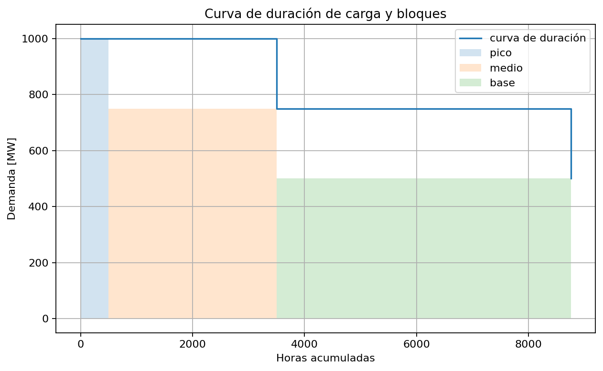
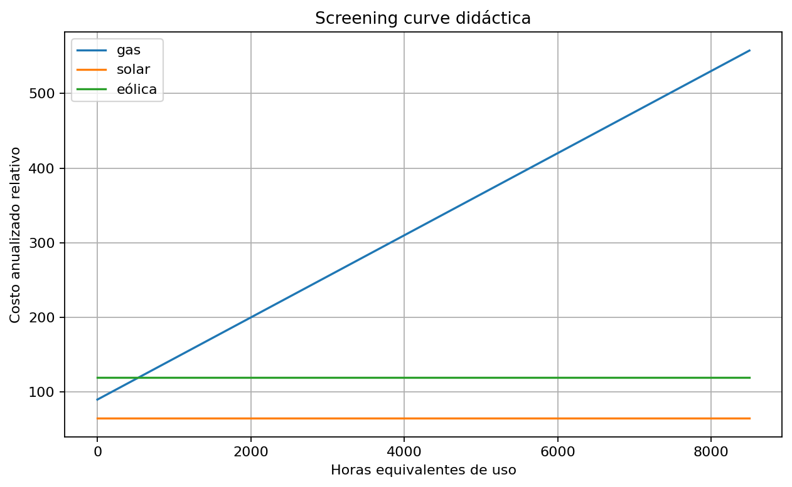

# 07 — Expansión de generación

[Menú principal](../../README.md) · [Actividades](actividades/README.md) · [Datos](datos/)

## Pregunta guía

¿Qué capacidad debe construirse para atender la demanda futura con costo mínimo, suficiencia y confiabilidad?

## Contexto técnico

La expansión de generación decide tecnologías, capacidades y años de entrada. Usa demanda proyectada, curva de duración, bloques de carga, costos de inversión, costos variables, disponibilidad, crédito firme y margen de reserva.

## Desarrollo conceptual

```text
demanda futura → energía y pico → tecnologías existentes y candidatas → CAPEX, FOM y VOM → curva de duración → bloques de carga → disponibilidad → crédito firme → reserva → capacidad acumulada
```

## Figuras centrales





## Modelos incluidos

| Modelo | Enlace |
| --- | --- |
| Modelo 01 — GEP estático de capacidad | [Abrir](modelos/01_modelo_gep_estatico_capacidad.md) |
| Modelo 02 — GEP con bloques de carga | [Abrir](modelos/02_modelo_gep_bloques_carga.md) |
| Modelo 03 — GEP multianual | [Abrir](modelos/03_modelo_gep_multianual.md) |

## Validación de resultados

La demanda por bloque debe estar cubierta; la generación anual no debe exceder disponibilidad; la capacidad firme debe cubrir demanda pico más reserva; la capacidad acumulada debe respetar inversiones previas; la tecnología seleccionada debe ser consistente con costos y horas de uso.
